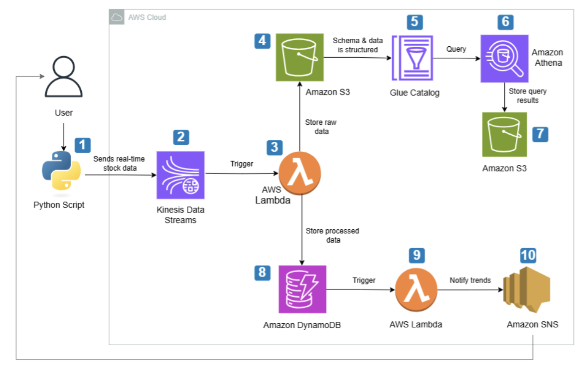
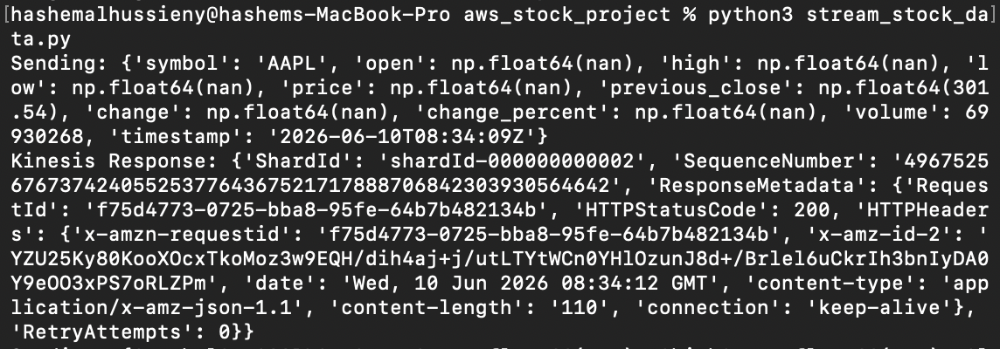
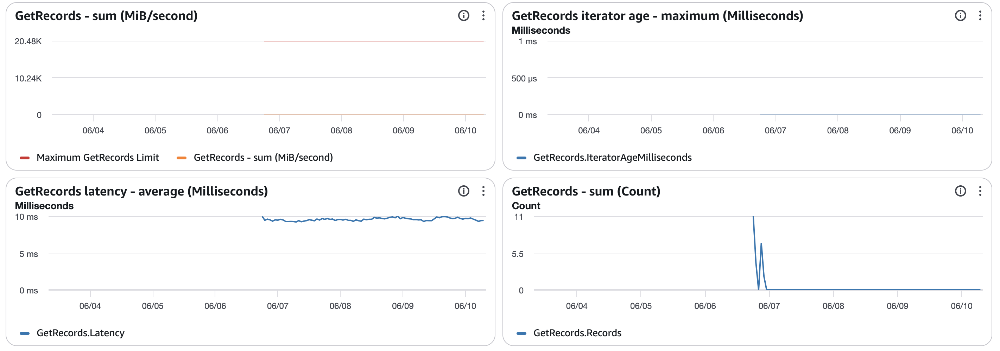
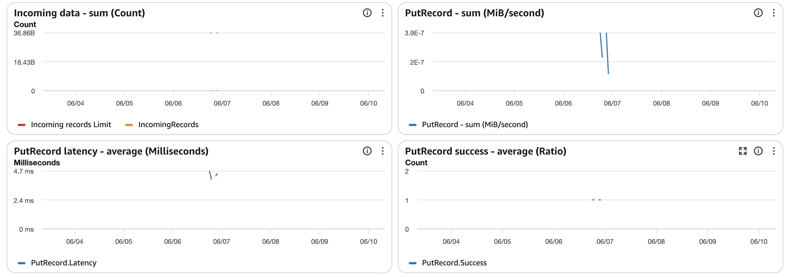
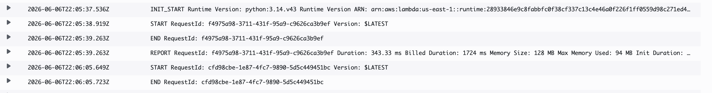
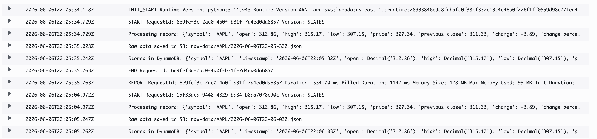
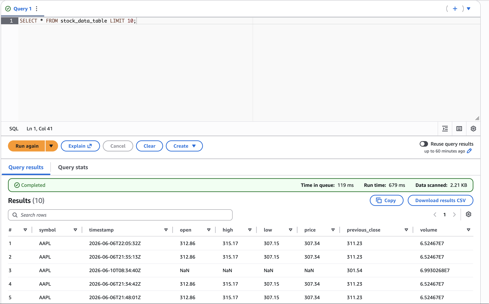
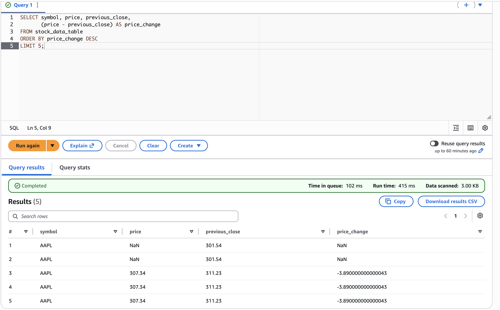
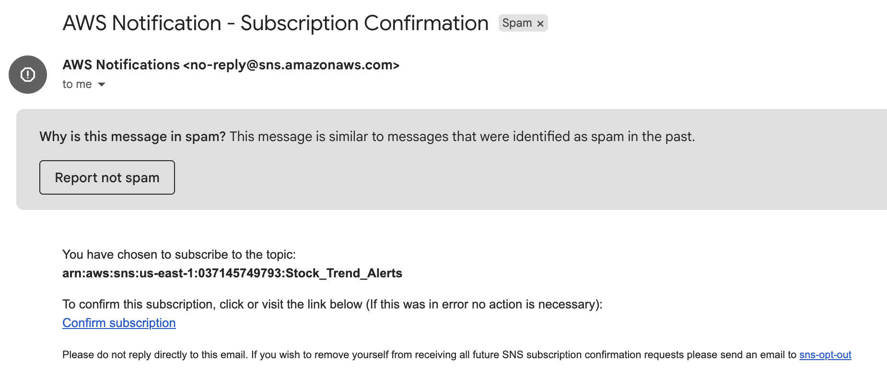

# 📈 Real-Time Stock Market Analytics Pipeline

An event-driven, serverless AWS pipeline that ingests, processes, stores, and analyzes stock market data in near real-time — with built-in anomaly detection and automated alerts for significant stock movements.

---

## Problem Statement

I have a genuine interest in the stock market and wanted to experiment with AWS to build something that could actually benefit me in some way, even if it doesn't replace the real tools out there. I found myself manually checking prices and missing movements I cared about, so I figured why not try and solve that with services on AWS. This project is the result of that, a serverless, event-driven pipeline that streams real-time stock data, detects anomalies, and sends me an alert when something significant happens. It gave me a reason to get hands-on with services like Kinesis, Lambda, and SNS in a context that felt meaningful.

---

## Architecture Diagram

> 

---

## Architecture Walkthrough

1. **Data Ingestion** — A Python producer script fetches real-time stock data using `yfinance` and streams records into **Amazon Kinesis Data Streams** every 30 seconds.
2. **Stream Processing** — A dedicated **AWS Lambda function (processor)** is triggered by Kinesis shard events. It processes each record and detects anomalies (e.g. price movements beyond a defined threshold).
3. **Raw Data Archiving** — The processor Lambda simultaneously writes raw stock records to **Amazon S3** in JSON format, partitioned by date, for long-term storage and historical analysis.
4. **Schema Cataloging** — **AWS Glue Data Catalog** automatically crawls and catalogs the S3 data, structuring it so Athena can query it using standard SQL without manual schema definition.
5. **Historical Querying** — **Amazon Athena** queries the cataloged S3 data lake directly, with query results stored back in a separate S3 bucket.
6. **Low-Latency Storage** — Processed and enriched stock records are written to **Amazon DynamoDB** for fast, low-latency querying by downstream applications or dashboards.
7. **Trend Evaluation** — A second dedicated **AWS Lambda function (trend evaluator)** is triggered by DynamoDB Streams. It evaluates stock trends against defined thresholds and determines whether an alert is warranted.
8. **Alerting** — When the trend evaluator detects a significant movement, it publishes a message to **Amazon SNS**, which delivers an Email/SMS alert to subscribed users in near real-time.

---

## AWS Services Used

| Service | Purpose |
| --- | --- |
| Amazon Kinesis Data Streams | Real-time data ingestion | 
| AWS Lambda (processor) | Stream processing & anomaly detection |
| AWS Lambda (trend evaluator) | Trend evaluation & alert triggering |
| Amazon DynamoDB | Low-latency storage of processed data | 
| Amazon S3 | Raw data archiving & query results storage | 
| AWS Glue Data Catalog | Schema cataloging for S3 data | 
| Amazon Athena | Historical SQL querying | 
| Amazon SNS | Real-time alerting (Email/SMS) | 
| AWS IAM | Access control & security |
| Amazon CloudWatch | Monitoring & logging | 

## Well-Architected Framework Alignment

**Reliability**
- Kinesis Data Streams retains records for 24 hours by default, ensuring no data loss if Lambda is temporarily throttled or unavailable.
- Lambda Dead Letter Queue (DLQ) configured to capture failed processing events for manual review.

**Performance Efficiency**
- DynamoDB provides single-digit millisecond read latency for processed stock records regardless of dataset size.
- Athena enables on-demand historical analysis without a persistent database or ETL pipeline.

**Cost Optimization**
- Fully serverless architecture means zero compute cost during off-hours (e.g. outside trading hours).
- Athena charges per query scanned — S3 data is partitioned by date to minimize scan size and cost.

**Security**
- Each Lambda function uses a dedicated IAM role with only the permissions it requires (least privilege).
- No API keys or credentials are hardcoded — all access is handled via IAM roles and environment variables.

**Operational Excellence**
- CloudWatch Logs automatically capture Lambda invocation logs and processing errors.
- SNS alerting provides immediate visibility into anomalies without manual monitoring.
---

## Key Design Decisions & Trade-offs

**Kinesis over SQS for ingestion**
Kinesis was chosen because it preserves the order of stock records per shard, which matters for accurate trend analysis. SQS standard queues do not guarantee ordering. Trade-off: Kinesis has a higher baseline cost and requires shard capacity planning at scale.

**DynamoDB over RDS for processed data**
Stock records have a consistent, document-like structure and are queried primarily by ticker symbol and timestamp — a simple key-value access pattern. DynamoDB handles this with low latency and no schema management overhead. Trade-off: no support for complex joins or ad-hoc relational queries.

**Athena over Redshift for historical analysis**
Given the project's scope, Athena's serverless, pay-per-query model is far more cost-effective than maintaining a Redshift cluster. Trade-off: Athena query latency (seconds) is higher than Redshift (sub-second), but acceptable for non-real-time historical analysis.

**Near Real-Time (30s delay) vs. Fully Real-Time**
The pipeline operates with an intentional 30-second ingestion interval. True tick-by-tick streaming would require higher Kinesis shard counts and more complex Lambda concurrency management, significantly increasing cost. For the analytics use case modeled here, 30-second granularity is sufficient.

---

## Screenshots
- Python Script Running:
  
   
  
- Kinesis Data Streams console showing incoming records:
  
   
   
  
- Lambda invocation logs in CloudWatch
  
    
    
  
- Athena query results against S3 data
  
     
     
   
- SNS alert email/SMS received
  
    

---
